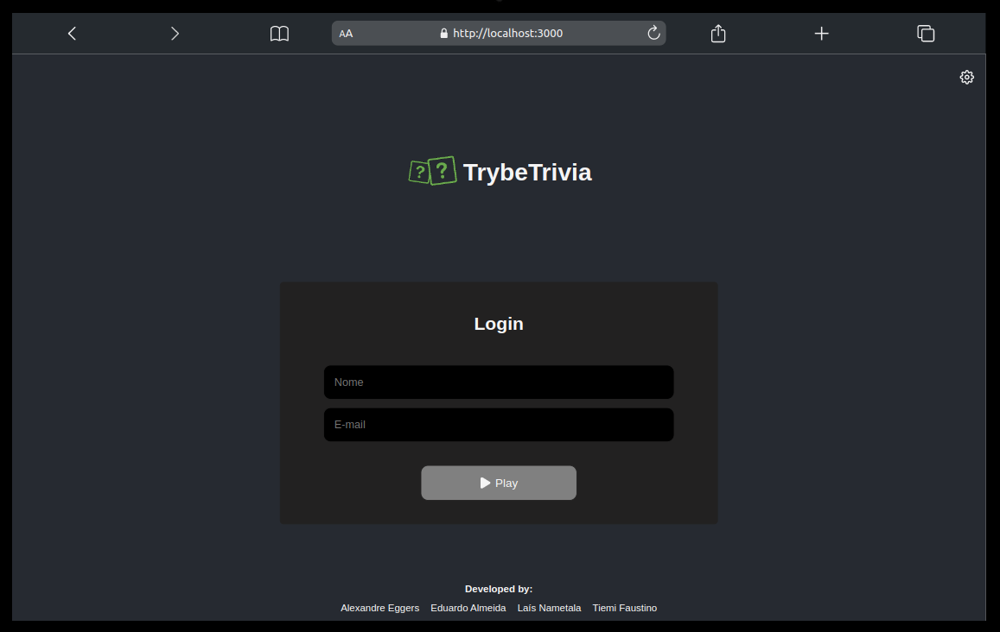

# 🕹️ Trybe Trivia


Group project developed during the Front-end module of [Trybe](https://www.betrybe.com/)'s Web Development course. We developed a question game based in a Trivia game using React and Redux doing an async fetching in the [Trivia API](https://opentdb.com/api_config.php).


## 👥 The team

|  |  |  |  |
|  :--: | :--: | :--: | :--: |
| [Laís Nametala](https://github.com/lalanametala) | [Eduardo Almeida](https://github.com/EduMLAlmeida) | [Alexandre Eggers](https://github.com/eggersss)  | [Tiemi Faustino](https://github.com/tiemifaustino) |


## ✨ Tech Stack

- 

- 

- 

- 


## 📚 Methodologies

- **SCRUM**
- **Kanban**


## 📹 Demo

### Login




## 💻 Run Locally

Clone the project

```bash
  git clone https://link-para-o-projeto
```

Go to the project directory

```bash
  cd my-project
```

Install dependencies

```bash
  npm install
```

Start the server

```bash
  npm run start
```

